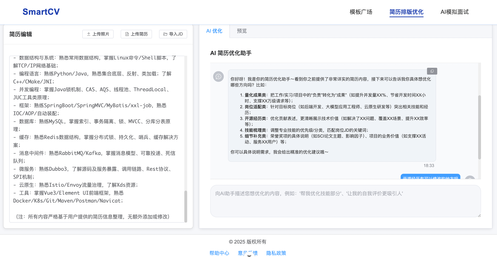

# SmartCV

简历排版、AI优化、模拟面试工具，高效搞定简历。

## 功能介绍

核心功能包含三个：简历排版、AI简历优化、模拟面试

### 简历排版
自动排版，将markdown格式的简历进行排版，支持多模板选择，动态改变主题颜色、字体、字体大小、行间距等参数；

### AI简历优化
结合用户简历和岗位JD信息，优化简历内容；

### 模拟面试
根据用户简历和岗位JD信息，同时结合题库，进行模拟面试；




## 快速开始

1. 克隆仓库
   ```bash
   git clone https://github.com/Fancy-hjyp/SmartCV.git
   ```

2. 安装依赖
   ```bash
   cd SmartCV/web
   npm install
   ```

3. 启动项目
   ```bash
   npm run dev
   ```

启动项目成功后，打开浏览器访问 http://localhost:5173，即可访问。

## 技术栈

- Vue 3
- TypeScript
- Vite
- Markdown-it

## 目录结构

```
web/
├── src/
│   ├── api/          # API 接口
│   ├── components/   # 组件
│   ├── prompts/      # 提示词
│   ├── router/       # 路由
│   ├── stores/       # 状态管理
│   ├── styles/       # 样式
│   ├── utils/        # 工具函数
│   └── views/        # 视图页面
```

## 核心技术点

## 贡献

欢迎提交 Issue 或 Pull Request。

## 许可证

MIT